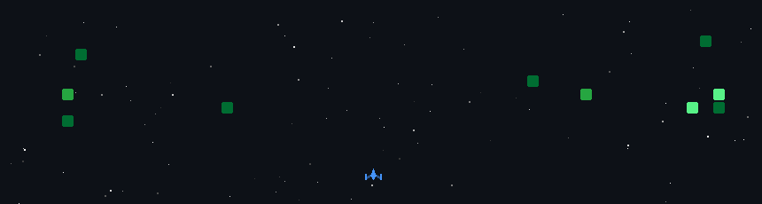

<!-- Header -->

### WHO AM I?

I’m **Hussein Raad** — a full‑stack developer, team lead and builder of web, mobile and cloud products.

- I lead cross‑functional teams at Ready Loans, Skillement and NuWatt, delivering AI‑powered lead distribution and solar monitoring platforms.
- I design and implement scalable and cost‑effective systems using AWS, NestJS, Next.js, FastAPI, Flutter and more.
- I mentor engineers and use automation and AI responsibly to accelerate development.

---

## ACHIEVEMENTS & MILESTONES

| Metric | Achievement | Status |
|:-----:|:-----------:|:------:|
| **Projects Delivered** | 10+ production deployments |  |
| **Teams Led** | 3 cross‑functional teams |  |
| **AI‑Driven Systems** | Lead distribution & solar monitoring |  |
| **Contributions (2024–2025)** | Active development |  |

---

## PROFESSIONAL TECH STACK

### Programming Languages

### Backend & Cloud

### Frontend & Mobile

### Databases & Storage

---

#### GitHub Statistics
I maintain **20+ public repositories** and actively contribute to open-source projects. In 2024-2025 alone, I pushed hundreds of commits across languages like Java, TypeScript, Python, and C, and frameworks such as NestJS, Next.js, FastAPI and Django. My work spans web, mobile and cloud development.

## Featured Projects

- **Ready Loans AI Distribution System** – Led the design and development of an AI‑driven lead distribution system for loan applications, including automation workflows using n8n and AWS.
- **Skillement – Aivros Platform** – Built and redesigned a cloud‑hosted learning management system with full automation and real‑time collaboration.
- **NuWatt Solar Monitoring** – Developed an AI‑powered monitoring and management platform and mobile app for solar systems.
- **Side Projects** – Applications for municipality citizen management and personal SaaS tools (LeadCreditPro.com, ScamsChecker.co).

---

